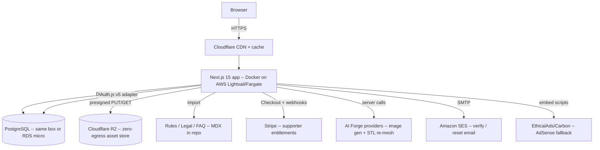

# Architecture

How Forgotten Letters is put together, and why the stack moved from a managed SaaS
trio (Vercel + Supabase + Sanity) to a fully open-source, self-hostable stack.

## Why we changed direction

The original plan leaned on managed services that are pleasant to start with but become
expensive exactly when the project succeeds:

- **Vercel Hobby forbids commercial use** — running ads or supporter billing pushes you
  to Pro ($20/mo) immediately.
- **Supabase** is storage- and egress-priced; this app is upload-heavy (map assets,
  avatars, AI-generated images, STL files), so the bill grows with usage, not revenue.
- **Sanity** adds a third vendor and seat costs for content that is mostly static.

For a **free, open-source project that earns only from ads + supporter tiers**, the
priority is a **low, predictable cost floor** and **no vendor lock-in**. Everything below
can run on a single small AWS box and is replaceable with open-source parts.

## System overview

Cloudflare sits in front for free CDN/caching and TLS; R2 (also Cloudflare) stores user
assets with **zero egress fees**, which is the single most important cost decision here
(see [`Costs.md`](Costs.md)). The Next.js app is one Docker image; Postgres runs either as
a sibling container on the same host (cheapest) or as RDS micro (more operational comfort).

## Old → new mapping

The product design is unchanged; only the implementation substrate moves. Apply this
mapping wherever the original `TODO.md` referenced a managed service:

| Concern                  | Old (managed)         | New (open-source / AWS)                                                |
| ------------------------ | --------------------- | ---------------------------------------------------------------------- |
| Database                 | Supabase Postgres     | PostgreSQL + **Drizzle ORM** (raw SQL migrations preserved)            |
| Auth                     | Supabase Auth         | **Auth.js v5** (Credentials + Google + GitHub), Drizzle adapter        |
| Row-level security       | Supabase RLS policies | App-layer authorization in server actions + DB constraints/checks      |
| Object storage           | Supabase Storage      | **Cloudflare R2** via S3 SDK + presigned URLs; quota enforced in app   |
| Official CMS             | Sanity                | **MDX-in-repo** (rules / legal / FAQ); Payload CMS optional for news   |
| Rate limiting            | Upstash Redis         | `rate-limiter-flexible` with a Postgres store                          |
| Hosting                  | Vercel                | **AWS Lightsail Containers / Fargate** + Docker, fronted by Cloudflare |
| Transactional email      | Supabase SMTP         | **Amazon SES**                                                         |
| Type generation          | `supabase gen types`  | Drizzle-inferred types (`$inferSelect` / `$inferInsert`)               |
| Cron (temp-file cleanup) | Vercel Cron           | Container cron / scheduled task (or Lightsail + EventBridge)           |

## Data layer

PostgreSQL accessed through **Drizzle ORM**. The schema from the original Phase 2 plan
carries over almost verbatim; it just becomes Drizzle table definitions plus SQL
migrations under `db/migrations/`.

**Core tables (unchanged from original plan):**
`profiles`, `game_systems`, `campaigns`, `scenarios`, `scenario_sections`,
`event_tables`, `uploaded_files`, `votes`, `favorites`, `comments`.

**New tables for the open-source / monetized model:**

- `subscriptions` — Stripe subscription mirror: `user_id`, `stripe_customer_id`,
  `stripe_subscription_id`, `tier` (`conscript` | `veteran` | `cartographer`),
  `status`, `current_period_end`.
- `entitlements` — flattened feature flags derived from subscription + donations:
  `user_id`, `ads_disabled`, `storage_quota_bytes`, `forge_credits`,
  `private_campaigns`, `is_supporter`, `updated_at`.
- `forge_jobs` — AI Forge runs: source model, prompt, provider, status, output asset
  keys, credits spent (supports the AI Forge design and credit accounting).

**Carried-over DB logic** (re-expressed as Drizzle/SQL, replacing Supabase triggers):

- `handle_new_user` → create a `profiles` row when an Auth.js user is created (in the
  adapter `createUser` hook or a Postgres trigger).
- `check_user_storage_quota(user_id, new_file_size)` → boolean guard before upload;
  quota comes from `entitlements.storage_quota_bytes`, not a hard-coded constant.
- `update_storage_used` → maintain `profiles.total_storage_used_bytes` on
  `uploaded_files` insert/delete.
- `get_vote_count(target_type, target_id)` → net vote count helper.

Types are inferred from Drizzle schema, so there is no separate generation step.

## Authentication & authorization

**Auth.js (NextAuth v5)** with the Drizzle adapter and three providers: Credentials
(email + password, with verification + reset-with-token flows over SES), Google, and
GitHub. Sessions are database-backed.

Supabase RLS is replaced by **explicit authorization in server actions**: every mutating
action checks `auth()` for the session and verifies ownership (`author_id === session.user.id`)
or role (`is_admin`) before touching data. Public-read rules become query filters
(`where is_published = true`). Destructive/admin paths additionally rely on DB constraints
(foreign keys, `CHECK` constraints, unique indexes) as a backstop.

## Object storage

**Cloudflare R2** behind the AWS S3 SDK (R2 is S3-compatible). Uploads use **presigned
PUT URLs** issued by a server action after a quota check; downloads/reads go through a
public Cloudflare custom domain (`NEXT_PUBLIC_ASSET_BASE_URL`) so egress is free. Two
buckets: `assets` (scenario maps, forge outputs, STL files) and `avatars`.

The temp-file lifecycle from the original Phase 5 plan is preserved: uploads start
`is_temporary = true`, are marked permanent on save, and a scheduled cleanup task deletes
abandoned temp files + their R2 objects after 24h and reconciles the storage counter.

## Official content (CMS)

Rules pages, the compendium, legal/ToS, and FAQ are **MDX files in the repo** under
`src/content/`. This is free, version-controlled, reviewable via PRs, and renders
statically — ideal for a FOSS project and for the **rules-version selector** (each edition
is a folder/frontmatter version). If non-technical editing of news/official scenarios is
later required, **Payload CMS** (open source, Postgres-backed, embeds in Next.js) can be
added without changing the rest of the stack.

## AI Forge

The Forge feature calls pluggable AI providers (image generation + STL re-mesh) from
**server-side** code only (keys never reach the client). A `forge_jobs` row tracks each
run and debits `entitlements.forge_credits`. Providers are abstracted behind a small
interface so they can be swapped; outputs land in R2 and are previewed/downloaded from
there. Generated content is subject to the moderation queue (see `UI-Surfaces.md` gap list).

## Monetization touchpoints

Monetization is woven through the app rather than bolted on (full detail in
[`Monetization.md`](Monetization.md)):

- **Ad slots** are components that read the viewer's `entitlements.ads_disabled` and render
  nothing for supporters.
- **Feature gates** (storage, private campaigns, Forge credits) read `entitlements`.
- **Stripe webhooks** (`/api/webhooks/stripe`) keep `subscriptions` + `entitlements` in
  sync; Ko-fi/GitHub Sponsors webhooks grant the supporter badge.

## Hosting & operations

Detailed in [`Deployment.md`](Deployment.md). In short: one Docker image, Lightsail
Containers (flat-rate, simplest) or Fargate (scales), Postgres co-located or RDS micro,
Cloudflare for CDN/TLS/R2, SES for email, GitHub Actions for build→deploy. The whole thing
is designed to run at a **~$10–20/mo floor** and to be reproducible by anyone who wants to
self-host their own instance.
