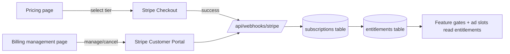

# Monetization

Forgotten Letters is free and open source. Community content is never paywalled. The
project sustains itself through **unobtrusive ads** (which supporters can turn off) and
**optional supporter tiers**. This document maps that model onto the existing Pricing
design and the app's feature gates.

## Principles

- **Community content stays free and public.** Ads and tiers fund hosting, not access.
- **Supporters remove ads.** Paying = a cleaner experience, more quota, and creator
  perks — not gatekeeping what others can read.
- **Privacy-first ads by default.** EthicalAds/Carbon need no tracking and no consent
  banner; AdSense is a consent-gated fallback only.
- **Low-friction support paths.** GitHub Sponsors / Ko-fi need zero billing code; Stripe
  is there for in-app tiers with real entitlements.

## Revenue channels

### Ads

| Network | Role | Consent | Notes |
|---|---|---|---|
| **EthicalAds / Carbon** | Primary | Not required (no tracking) | On-brand for a FOSS/dev audience; modest but clean RPM |
| **Google AdSense** | Fallback | **Required** (cookie-consent banner) | Higher revenue; only loads after explicit consent |

Implementation: an `<AdSlot/>` component (in `components/monetization/`) renders nothing
when the viewer's `entitlements.ads_disabled` is true. It prefers EthicalAds; it loads
AdSense **only** if (a) EthicalAds is unavailable for the slot and (b) the visitor has
accepted cookies via the consent banner. Ad placements are limited to non-intrusive
positions (browse index rails, between list pages) — never inside the map editor, warband
builder, battle tracker, or AI Forge workspace.

### Supporter tiers (Stripe)

Tiers come straight from the **Pricing design** (`Marketing.jsx`):

| Tier | Price | What it unlocks |
|---|---|---|
| **Conscript** | Free | 3 warbands, 5 scenarios, 1 campaign (≤4 players), public only, **ads shown**, 50 MB storage |
| **Veteran** *(POPULAR)* | €6/mo (€60/yr, save 17%) | **Ads off**, unlimited warbands/scenarios, private campaigns, custom sigil/portrait uploads, themed PDF export, **5 GB storage**, monthly Forge credits |
| **Cartographer** *(PRO)* | €14/mo | Everything in Veteran + **50 GB storage**, custom domain, spectator/live battle log, API write access, co-author, priority support, larger Forge credit grant |

The monthly/yearly toggle, the feature-compare table, and the pricing FAQ already exist in
the design and map 1:1 to these tiers.

### Donations (GitHub Sponsors / Ko-fi)

Zero-integration support: links in the footer and on the Pricing/Support page. A Ko-fi
webhook (optional) or a manual review can grant a **Supporter badge** (`entitlements.is_supporter`)
and turn ads off as a thank-you, without running full subscription billing.

## Feature gates → entitlements

All gating reads the `entitlements` table (see [`Architecture.md`](Architecture.md)),
which is derived from the active Stripe subscription plus any donation grants:

| Entitlement | Conscript | Veteran | Cartographer |
|---|---|---|---|
| `ads_disabled` | false | true | true |
| `storage_quota_bytes` | 50 MB | 5 GB | 50 GB |
| `private_campaigns` | false | true | true |
| `forge_credits` (monthly) | 0 | small grant | larger grant |
| `max_warbands` | 3 | ∞ | ∞ |
| `max_scenarios` | 5 | ∞ | ∞ |
| `api_write` | false | false | true |
| `is_supporter` (badge) | false | true | true |

Server actions check entitlements before privileged operations (creating beyond a quota,
making a campaign private, spending Forge credits, uploading past the storage cap). The
UI surfaces upsell prompts at these boundaries (see "Upsell UX" below).

## Billing flow (Stripe)

- **Checkout:** Pricing page → Stripe Checkout session for the chosen price ID
  (`STRIPE_PRICE_*`).
- **Webhooks** (`/api/webhooks/stripe`, verified with `STRIPE_WEBHOOK_SECRET`): on
  `customer.subscription.created/updated/deleted` and `invoice.paid`, upsert
  `subscriptions` and recompute `entitlements`.
- **Manage:** a Billing page links to the **Stripe Customer Portal** for upgrades,
  payment-method changes, invoices, and cancellation (avoids building that UI).
- **Downgrade/expiry:** when a subscription lapses, entitlements fall back to Conscript at
  `current_period_end`; nothing the user authored is deleted, but quotas re-apply.

## Compliance

- **Cookie-consent banner** (in `components/monetization/`) gates AdSense and any
  non-essential cookies; EthicalAds/Carbon and core auth cookies are exempt.
- Tie into the existing **Legal / Privacy / Cookie** MDX pages from the design.
- Stripe handles PCI scope; we never touch card data. VAT/tax is handled via Stripe Tax.
- Donations and supporter badges carry no special data-handling burden beyond the email
  already on file.

## What lands in code (future PR)

This doc is the spec. The implementation PR will add: `components/monetization/AdSlot`,
`CookieConsent`, `UpsellDialog`, `SupporterBadge`; `lib/billing/` (Stripe client,
entitlement computation, feature-gate helpers); `/api/webhooks/stripe` and an optional
`/api/webhooks/kofi`; the `subscriptions` + `entitlements` tables; and the Pricing,
Support, and Billing-management routes from [`UI-Surfaces.md`](UI-Surfaces.md).
